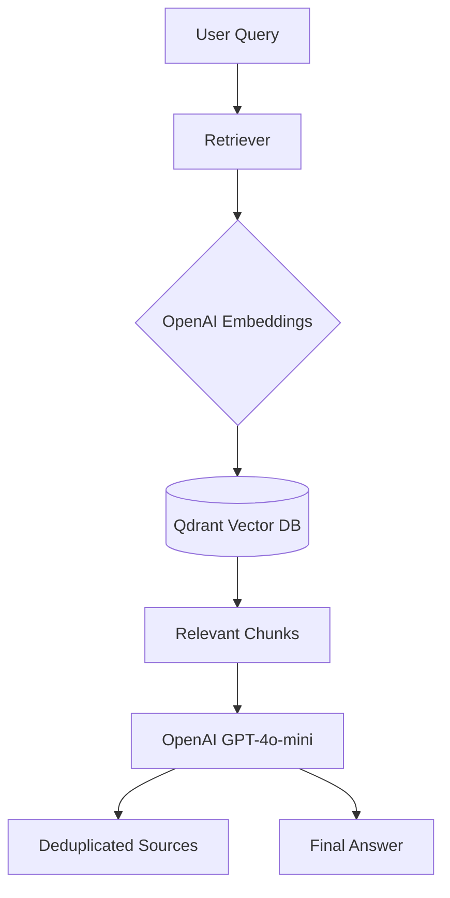

# RAG System with Qdrant & OpenAI

Hệ thống **Retrieval-Augmented Generation (RAG)** hoàn chỉnh, sử dụng sức mạnh phối hợp của OpenAI và Qdrant.

## 🚀 Tính năng chính
- 🎯 **Full OpenAI Stack**: Sử dụng `text-embedding-3-small` để nhúng và `gpt-4o-mini` để suy luận.
- 🗄️ **Qdrant Vector DB**: Lưu trữ và truy vấn vector hiệu năng cao với Metadata Filter.
- 🕸️ **Firecrawl Integration**: Tự động cào dữ liệu từ URL sang định dạng Markdown sạch.
- 📁 **Multi-format Loader**: Hỗ trợ nạp dữ liệu từ PDF, DOCX, TXT và Markdown.
- ⚡ **Hybrid Access**: Hỗ trợ cả giao diện Web (FastAPI) và dòng lệnh (CLI Demo).

---

## 🛠️ Công nghệ sử dụng
- **Vector Database**: [Qdrant](https://qdrant.tech/)
- **LLM (Generation)**: OpenAI `gpt-4o-mini`
- **Embedding**: OpenAI `text-embedding-3-small` (1536 dims)
- **Web Scraping**: [Firecrawl](https://firecrawl.dev/) (Self-hosted)
- **Framework**: FastAPI, Pydantic v2, Loguru

---

## 📂 Cấu trúc thư mục
```
day07/
├── main.py                   # Entry point (FastAPI server & CLI Demo)
├── .env                      # Cấu hình API Keys và URL
├── rag/
│   ├── pipeline.py           # Orchestrator (Nhạc trưởng điều phối RAG)
│   ├── ingestion/            # Loader, Chunker, Indexer
│   ├── retrieval/            # Retriever (Search & Filter)
│   └── generation/           # OpenAIGenerator (GPT-4o-mini)
├── data/                     # Thư mục chứa tài liệu mẫu (.txt, .md)
└── scripts/                  # Các script CLI bổ trợ
```

---

## ⚙️ Cài đặt & Cấu hình

### 1. Cài đặt thư viện
```bash
pip install -r requirements.txt
```

### 2. Thiết lập môi trường
Tạo file `.env` từ `.env.example` và điền các thông tin:
```dotenv
OPENAI_API_KEY=sk-...
FIRECRAWL_API_URL=http://localhost:3002
QDRANT_URL=http://localhost:6333
```

---

## 🚀 Cách sử dụng

### 1. Chế độ Manual Demo (Dòng lệnh)
Dùng để kiểm tra nhanh hệ thống bằng cách nạp toàn bộ file trong thư mục `data/` và trả lời câu hỏi:
```bash
# Chạy demo với câu hỏi mặc định
python3 main.py

# Chạy demo với câu hỏi cụ thể
python3 main.py "Hệ thống RAG này hoạt động như thế nào?"
```

### 2. Chế độ Web Server (FastAPI)
Dùng để tích hợp vào ứng dụng khác hoặc dùng giao diện Swagger:
```bash
uvicorn main:app --reload --port 8000
```
Truy cập: `http://localhost:8000/docs` để thử nghiệm các endpoint `/ingest` và `/query`.

### 3. CLI Scripts bổ trợ
```bash
# Nạp một file cụ thể
python3 scripts/ingest.py file data/my_doc.pdf --language vi

# Hỏi trực tiếp qua script query
python3 scripts/query.py ask "Nội dung chính của file a.md là gì?"
```

---

## 📊 Metadata Schema (Payload)
Mỗi đoạn văn bản lưu trong Qdrant bao gồm các thông tin:
- `source`: Nguồn tài liệu (URL hoặc đường dẫn file).
- `content_type`: Loại nội dung (web, pdf, text, ...).
- `created_at`: Thời gian nạp dữ liệu.
- `text`: Nội dung văn bản gốc.
- `tags`: Các thẻ phân loại.

---

## 🏗️ Kiến trúc hệ thống


---
> **Lưu ý**: Hệ thống yêu cầu Docker chạy Qdrant và Firecrawl Self-hosted để hoạt động đầy đủ tính năng quét Web.
